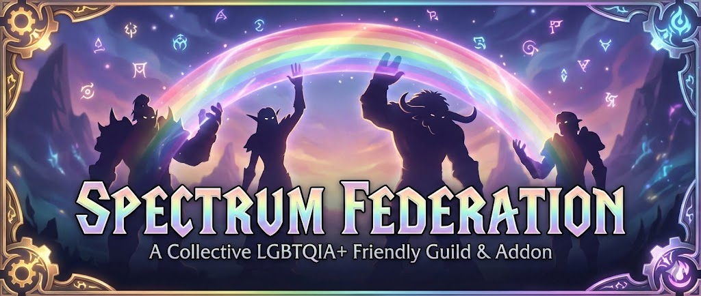

<!-- STATUS_BADGES_START -->


<!-- STATUS_BADGES_END -->


World of Warcraft addon for the Spectrum Federation guild on Garona.

---

## 📚 Documentation

For detailed information about our guild, addon features, and guides, visit our documentation site:

**[View Full Documentation →](https://osulivanab.github.io/SpectrumFederation/)**

---

## Installation

### WowUp Installation

- Open WowUp, go to **Get Addons**, search for "Spectrum Federation", and install directly.
- Alternatively, use the Install from URL option and paste:
  ```
  https://github.com/OsulivanAB/SpectrumFederation
  ```

### CurseForge Installation

- Spectrum Federation is available on CurseForge — search for "Spectrum Federation" in the CurseForge client or visit:
  https://www.curseforge.com/wow/addons/spectrum-federation
- Use the CurseForge client or the website to download/install the addon.

### Manual Installation

1. Download the latest release from the [Releases page](https://github.com/OsulivanAB/SpectrumFederation/releases)
2. Extract the downloaded ZIP file
3. Copy the SpectrumFederation folder to your World of Warcraft AddOns directory:
  - **Windows**: C:\Program Files (x86)\World of Warcraft\_retail_\Interface\AddOns\
  - **macOS**: /Applications/World of Warcraft/_retail_/Interface/AddOns/
4. Restart World of Warcraft or type `/reload` in-game
