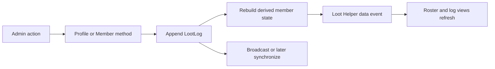
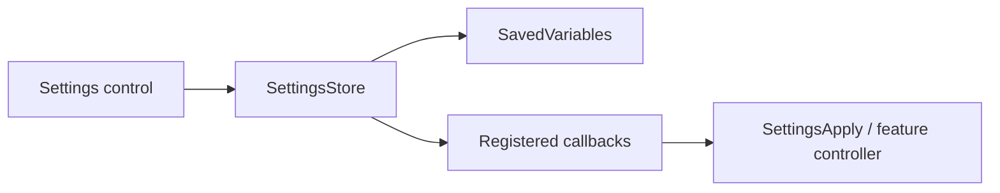

# Addon Architecture

## Initialization and load order

`SpectrumFederation.toc` is the authoritative load order. Libraries and foundational modules load first, followed by Loot Helper models, the sync protocol, settings, UI pages, Loot Helper windows, `modules/Init.lua`, and finally `SpectrumFederation.lua`.

There are two initialization paths:

- `modules/Init.lua` initializes settings storage/application and the standalone settings UI.
- `SpectrumFederation.lua` handles `PLAYER_LOGIN`, initializes diagnostics and Loot Helper persistence, enables sync, and registers feature slash commands.

Modules share the table passed by WoW as the addon's second vararg:

```lua
local addonName, SF = ...
```

## Major subsystems

| Area | Responsibility |
| --- | --- |
| `modules/core.lua` | Shared class metadata and time/version helpers. |
| `modules/NameUtil.lua` | Realm-aware player normalization and comparison. |
| `modules/MessageHelpers.lua` | Consistent user-facing chat messages. |
| `modules/debug.lua` | Persistent, bounded diagnostic logging. |
| `modules/SlashCommands.lua` | `/sf` dispatch and feature command registry. |
| `modules/Settings/` | Defaults, migrations, path-based storage, per-character storage, and runtime application. |
| `modules/UI/Settings/` | Page registry, standalone navigation window, controls, dialogs, and page definitions. |
| `modules/LootHelper/` | Profile, member, and log domain models plus serialization and the current communication adapter. |
| `modules/LootHelperSync/` | Session state, validation, requests, convergence, heartbeat, routing, bulk handlers, and public API. |
| `modules/UI/LootHelper/` | Roster/equipment presentation and controller logic. |
| `modules/RaidCheck.lua` | Inspection cache, equipment evaluation, whispers, snapshots, and point awards. |
| `modules/VersionCheck.lua` | Raid/party addon-version query, roster snapshot, and `/sf version` window. |

## Persistent data

The TOC declares:

- `SpectrumFederationDB` — account-wide settings, profiles, logs, equipment snapshots, and resumable sync-session identity.
- `SpectrumFederationDebugDB` — debug enabled state and up to 500 diagnostic entries.
- `SpectrumFederationCharDB` — character-specific gameplay choices, currently Press and Hold Casting by specialization.

WoW serializes plain tables, not metatables. Loot Helper database initialization restores `LootProfile`, `Member`, and `LootLog` metatables after SavedVariables load.

Settings schema migrations normalize older database shapes before defaults are merged. Domain models also contain compatibility normalization for profile snapshots and older saved fields.

## Event and update flow

Profile mutations create immutable `LootLog` entries. Member point and equipment state is rebuilt from these entries, and Loot Helper events refresh the visible roster.



Settings follow a separate path:



## Permissions

Authorization is enforced by specific guarded domain methods, log insertion, and sync validation, but Store adapters and low-level `LootProfile` mutators are not uniformly guarded. Callers must check authorization before invoking an unguarded write path; disabled UI controls alone are not a security boundary. Sync verifies group membership, sender identity, and profile authorization before accepting network changes.

The profile creator is the initial owner and admin. Ownership and admin membership use normalized `Name-Realm` identifiers. Use `NameUtil` for comparisons because connected-realm and short-name forms can differ.

## Combat and asynchronous APIs

Settings application can debounce and defer work until `PLAYER_REGEN_ENABLED`. The Press and Hold Casting automation uses this path.

Raid inspection and item information are asynchronous and throttled. `RaidCheck.lua` queues inspect requests, caches current and profile-backed snapshots, tracks pending/stale states, and notifies UI listeners through a snapshot version.

Sync scheduling similarly centralizes jitter, retry, timeout, and timer behavior instead of making handlers block.

## Public extension points

The codebase exposes internal addon APIs on `SF`, including:

- `SF:RegisterSlashCommand(...)`;
- `SF.SettingsStore` and `SF.SettingsApply`;
- `SF.SettingsUI:RegisterPage(...)`;
- `SF.LootHelperEvents`;
- `SF.LootHelperSync` public session and safe-mode methods;
- `SF.Debug` and message helpers.

These are internal project APIs, not stable third-party compatibility guarantees. Prefer feature-level methods over writing SavedVariables directly.
