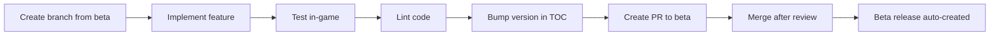

# Getting Started with Development

Welcome to SpectrumFederation development! This guide will help you set up your environment and start contributing.

## Project Overview

SpectrumFederation is a World of Warcraft addon written in **Lua 5.1** for the Spectrum Federation guild on Garona. It targets both Retail and Beta/PTR versions of WoW.

## Development Environment

### Prerequisites

- **Git** - For version control
- **Visual Studio Code** - Recommended editor with dev container support
- **Docker** - For dev container (or local Lua 5.1 + luacheck)
- **WoW Client** - For in-game testing

### Quick Setup

1. **Clone the repository**:
   ```bash
   git clone https://github.com/OsulivanAB/SpectrumFederation.git
   cd SpectrumFederation
   ```

2. **Open in VS Code**:
   ```bash
   code .
   ```

3. **Start dev container** (recommended):
   - VS Code will prompt to "Reopen in Container"
   - This installs all tools automatically (Lua, luacheck, Python, etc.)

4. **Or install tools locally**:
   ```bash
   # Lua 5.1 and luacheck
   sudo apt-get install lua5.1 luarocks
   sudo luarocks install luacheck
   
   # Python tools for CI scripts
   pip install yamllint ruff
   ```

## Code Structure

### Addon Files

All addon code lives in `SpectrumFederation/`:

```
SpectrumFederation/
├── SpectrumFederation.lua       # Entry point, event registration
├── SpectrumFederation.toc       # Addon manifest (load order, version)
├── modules/
│   ├── debug.lua                # Debug logging system
│   ├── LootProfiles.lua         # Profile CRUD operations
│   └── settings_ui.lua          # Main settings panel
├── settings/
│   └── loot_helper.lua          # Loot Helper UI section
├── locale/
│   └── enUS.lua                 # Localization strings
└── media/
    ├── Fonts/
    ├── Icons/
    └── Textures/
```

**Critical files:**
- `SpectrumFederation.toc` - **MUST update `## Version:` for every PR**
- Load order is top-to-bottom in TOC file

### Repository Structure

```
.
├── SpectrumFederation/          # Addon code (packaged for WoW)
├── .github/
│   ├── scripts/                 # Python CI/CD helper scripts
│   └── workflows/               # GitHub Actions workflows
├── docs/                        # MkDocs documentation (this site!)
└── .devcontainer/               # Dev container configuration
```

## Making Changes

### 1. Create a Feature Branch

Always branch from `beta`:

```bash
git checkout beta
git pull origin beta
git checkout -b feature/my-feature
```

### 2. Make Your Changes

- Edit addon files in `SpectrumFederation/`
- Follow existing code patterns
- Add debug logging: `SF.Debug:Info("CATEGORY", "message")`
- **Bump version in TOC**: `## Version: X.Y.Z-beta.N`

### 3. Test In-Game

Create a symlink from your WoW AddOns folder:

```bash
# Example (adjust path for your system)
ln -s /path/to/SpectrumFederation/SpectrumFederation /path/to/WoW/_retail_/Interface/AddOns/
```

Then in-game:
- Enable addon in addon list
- Use `/reload` after code changes
- Check for Lua errors: `/console scriptErrors 1`
- Test slash command: `/sf`

### 4. Lint Your Code

```bash
# From repository root
python3 .github/scripts/lint_all.py
```

This checks:
- **Lua** (luacheck) - Syntax and style
- **YAML** (yamllint) - Workflow files
- **Python** (ruff) - CI scripts

### 5. Create a Pull Request

1. Push your branch:
   ```bash
   git add .
   git commit -m "feat: add my feature"
   git push origin feature/my-feature
   ```

2. Open PR to `beta` branch on GitHub

3. Wait for CI checks to pass:
   - ✅ Linting
   - ✅ Package validation
   - ✅ Version bump check
   - ✅ Duplicate release check

4. Request review from maintainers

## Development Workflow

### Feature Development



### Version Format

- **Beta**: `0.0.17-beta.1` (development)
- **Stable**: `0.0.17` (released via promotion)

**Rules:**
- Every behavioral change requires version bump
- Documentation-only changes don't require bump
- CI will fail if version not bumped

## Key Files to Know

### SpectrumFederation.toc

The addon manifest. **Most important file!**

```
## Interface: 120000          # WoW patch version
## Version: 0.0.17-beta.1     # MUST BUMP FOR EVERY PR
## Title: Spectrum Federation
## Author: OsulivanAB

# Load order (top to bottom)
SpectrumFederation.lua
modules/debug.lua
modules/LootProfiles.lua
settings/loot_helper.lua
modules/settings_ui.lua
```

### SavedVariables

Declared in TOC, accessed via `SF.db`:

```lua
-- In TOC
## SavedVariables: SpectrumFederationDB, SpectrumFederationDebugDB

-- In Lua
SF.db = SpectrumFederationDB  -- Main data
SF.debugDB = SpectrumFederationDebugDB  -- Debug logs
```

## Common Tasks

### Add a New Module

1. Create file in `SpectrumFederation/modules/`:
   ```lua
   local addonName, SF = ...
   
   function SF:MyNewFeature()
       SF.Debug:Info("FEATURE", "Doing something")
       -- Your code here
   end
   ```

2. Add to TOC after dependencies:
   ```
   modules/debug.lua
   modules/MyNewModule.lua
   ```

3. Call from entry point or settings UI

### Add Debug Logging

```lua
-- Available levels: Verbose, Info, Warn, Error
SF.Debug:Info("CATEGORY", "Message with %s", arg)
SF.Debug:Error("PROFILES", "Failed to create profile: %s", err)
```

View logs in-game:
- `/sfdebug on` - Enable debug mode
- `/sfdebug show` - Show debug UI

### Add Settings UI Section

1. Create file in `SpectrumFederation/settings/`:
   ```lua
   function SF:CreateMySection(panel, anchorFrame)
       local section = CreateFrame("Frame", nil, panel)
       -- Build your UI
       return section
   end
   ```

2. Call from `settings_ui.lua`:
   ```lua
   local mySection = SF:CreateMySection(panel, previousSection)
   ```

## Useful Commands

### In-Game

- `/sf` - Open settings panel
- `/reload` - Reload UI after code changes
- `/console scriptErrors 1` - Show Lua errors

### Development

```bash
# Lint everything
python3 .github/scripts/lint_all.py

# Validate addon package
python3 .github/scripts/validate_packaging.py

# Check version bump (for PRs)
python3 .github/scripts/check_version_bump.py beta

# Test Blizzard API
python3 .github/scripts/blizzard_api.py --environment live
```

## Resources

- [CI/CD Workflows](workflows.md) - Automated builds and releases
- [Promoting to Main](promoting-to-main.md) - How to release stable versions
- [Naming Conventions](naming-conventions.md) - Code style guidelines
- [WoW API Docs](https://wowpedia.fandom.com/wiki/World_of_Warcraft_API) - Official API reference

## Getting Help

- Check existing code for patterns
- Review `BlizzardUI/live/` (generated in dev container) for API examples
- Ask in project discussions or issues

## Next Steps

Ready to contribute? Check out:

1. [Open Issues](https://github.com/OsulivanAB/SpectrumFederation/issues) - Find something to work on
2. [CI/CD Workflows](workflows.md) - Understand the automation
3. [Project Board](https://github.com/OsulivanAB/SpectrumFederation/projects) - See what's planned

Happy coding! 🚀

