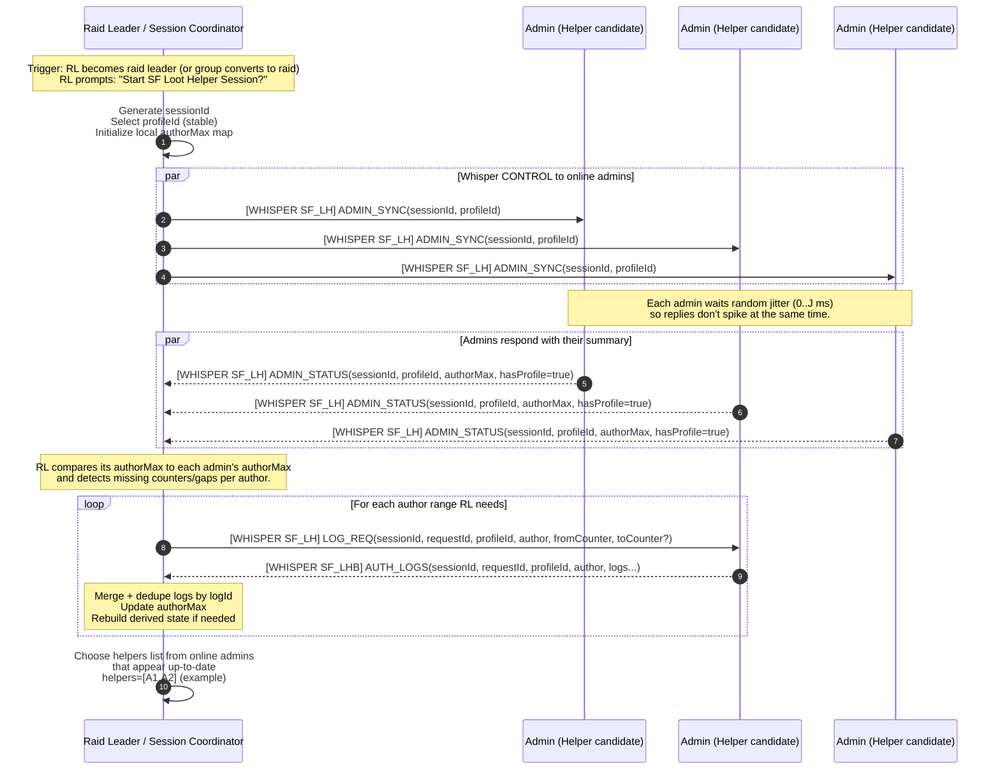
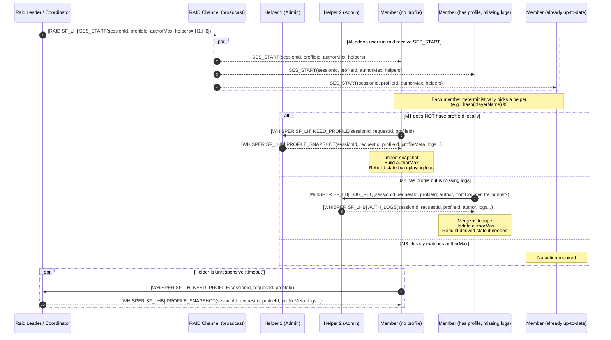
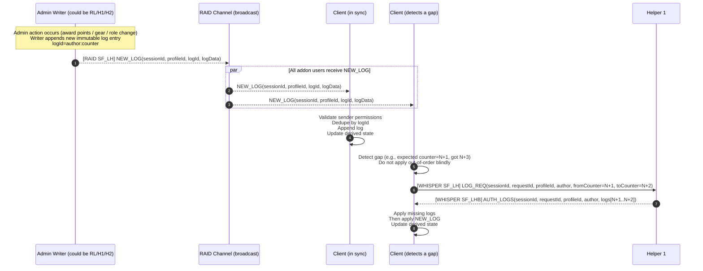
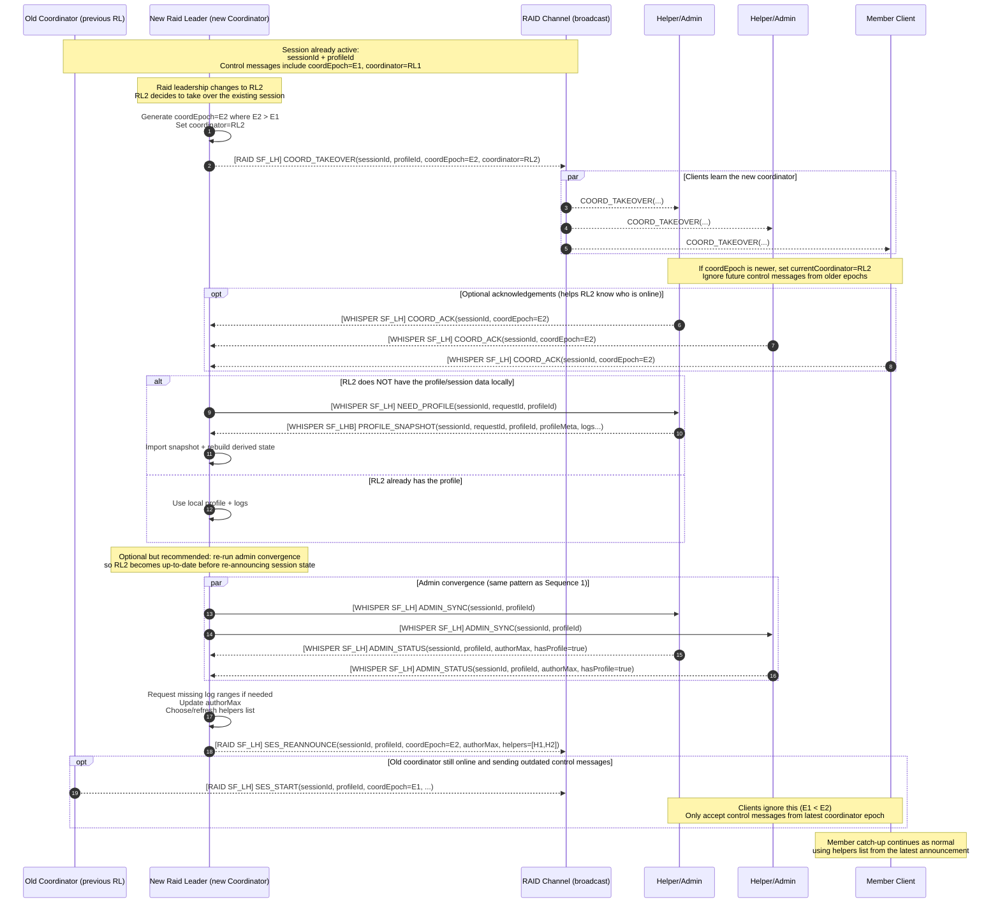

# **SF Loot Helper Session Sync Sequence**

This page documents the **message choreography** for syncing a Loot Helper profile in a raid session, based on a **log-replication** model:

* **LootLogs are append-only** and are the source of truth.

* Member state is derived by replaying logs.

* Sync is accomplished by exchanging “what logs do you have?” summaries and transferring missing log ranges.

* A **leader/coordinator** starts the session and publishes a **helpers list** so bulk transfers can be distributed.

---

## **Legend**

**Prefixes / traffic classes**

* `SF_LH` \= **Control** (small messages: session start, status, requests)

* `SF_LHB` \= **Bulk** (large payloads: log batches, snapshots; typically compressed)

**Distribution notation**

* `[RAID]` \= broadcast to raid

* `[WHISPER]` \= targeted to one player

**IDs**

* `sessionId` \= identifies the current SF Loot Helper Session (raid-scoped)

* `requestId` \= correlates one request with its responses (bulk transfers, multi-part batches)

* `profileId` \= stable, stored unique ID for the profile (NOT derived from name/owner)

**Log identity**

* `logId = author:counter` (or equivalent stable unique id)

* `authorMax = { [author] = maxCounterSeen }`

---

## **Sequence 1: Session creation and admin convergence (leader pre-sync)**

**Notes**

* Admin convergence happens **before** the raid sees `SES_START`.

* Bulk transfers (AUTH\_LOGS) are **WHISPER \+ bulk prefix** to keep the raid channel clean.

---

## **Sequence 2: Session announcement and member catch-up using helpers**

**Notes**

* The helpers list is the “middle ground” approach:

  * The leader coordinates.

  * Bulk transfer load is shared across helpers.

* Members only pull data when needed; most clients do nothing.

---

## **Sequence 3: Live updates during raid (append-only log broadcast)**

---

## **Sequence 4: Raid leader changes mid-session (coordinator handoff)**

This sequence shows how the active session can **continue without a full restart** when raid leadership changes (promotion/demotion or the coordinator disconnecting).

Key idea: session control messages include a **coordinator generation** value (I’ll call it `coordEpoch`). Clients treat the coordinator as:  
 **the sender with the highest `coordEpoch` seen for that `sessionId`.**

**Implementation notes (still “plan level”, not code):**

* `coordEpoch` can simply be `time()` at takeover. If two takeovers happen in the same second, break ties by choosing the lexicographically larger coordinator name (or add a random suffix).

* This `coordEpoch` rule only applies to **control messages** (session start/reannounce, helper lists, etc.).  
   For **log replication** (`NEW_LOG`), clients should accept messages from any valid admin for that `sessionId/profileId` (deduped by `logId`)—so awarding doesn’t “pause” during a handoff.

* If takeover ever gets messy (e.g., repeated flips), you can add a “hard reset” fallback: RL2 broadcasts `SES_END(oldSessionId)` and then a fresh `SES_START(newSessionId)` (more disruptive, but very deterministic).

**Notes**

* Live updates are “easy mode” because a new log entry is small.

* Gap detection is your safety net for real-world delivery weirdness.

---

## **Operational rules (non-diagram)**

These are the “guardrails” that keep the sequence above stable:

* **Jitter** on replies (admins \+ members): random delay to avoid synchronized bursts.

* **Timeout \+ fallback**: if the chosen helper doesn’t respond, retry with another helper or the leader.

* **Permission validation**: only accept and apply changes from valid admins (per the profile’s admin list).

* **Idempotency**: all log application is safe to repeat (dedupe by `logId`).

* **Rebuild policy**: if you ever insert older logs or fill a gap, recompute derived state by replaying logs.

---

If you want, next we can add a fourth (small) diagram covering the edge-case: **raid leader changes mid-session** (handoff / new coordinator re-announces `SES_START` with the same `sessionId` or a new one), but the three above are the core “happy path \+ gap repair” flows you’ll be implementing first.
