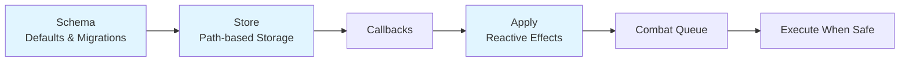
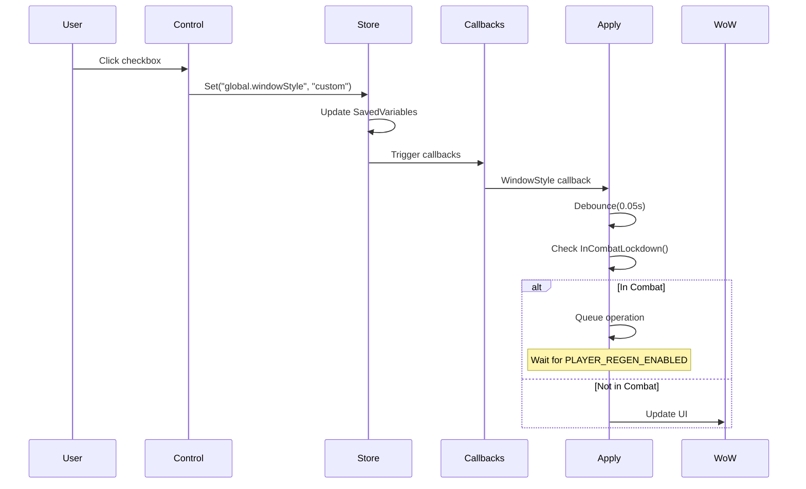

# Settings Data Layer

The data layer manages the storage, validation, and reactive application of settings. It consists of three core modules: Schema, Store, and Apply.

## Architecture



## Schema Module

**Location**: `SpectrumFederation/modules/Settings/Schema.lua`

The Schema module defines the structure and defaults for all settings.

### Default Values

```lua
SF.Settings.Schema.DEFAULTS = {
    version = 3,
    global = {
        windowStyle = "blizzard",  -- "blizzard" or "custom"
        fontStyle = "default",      -- Font family
        fontSize = 12               -- Font size
    },
    lootHelper = {
        enabled = true,
        profiles = {},              -- ID-keyed profile storage
        activeProfileId = nil       -- Current active profile
    }
}
```

### Enums

```lua
SF.Settings.Schema.WINDOW_STYLES = { "blizzard", "custom" }
SF.Settings.Schema.FONT_FAMILIES = {
    "Fonts\\FRIZQT__.TTF",
    "Fonts\\ARIALN.TTF",
    -- ... more fonts
}
```

### Schema Versioning

The Schema uses versioning to handle data migrations:

```lua
SF.Settings.Schema.VERSION = 3

SF.Settings.Schema.MIGRATIONS = {
    [2] = function(db)
        -- Migration from v1 to v2
    end,
    [3] = function(db)
        -- Migration from v2 to v3: Convert name-based profiles to ID-based
        local oldProfiles = db.lootHelper.profiles or {}
        local newProfiles = {}
        
        for name, profile in pairs(oldProfiles) do
            local id = GenerateProfileId()
            newProfiles[id] = {
                id = id,
                name = name,
                -- ... migrate other fields
            }
        end
        
        db.lootHelper.profiles = newProfiles
    end
}
```

### Validation

**Profile Name Validation**

```lua
SF.Settings.Schema.ValidateProfileName(name)
```

**Parameters**:

- `name` (string) - The profile name to validate

**Returns**:

- `valid` (boolean) - Whether the name is valid
- `error` (string|nil) - Error message if invalid

**Rules**:

- Must not be empty after trimming
- Maximum 24 characters
- No dots (`.`) allowed
- Automatically trimmed

**Example**:

```lua
local valid, error = SF.Settings.Schema.ValidateProfileName("My Profile")
if not valid then
    SF:PrintError(error)
end
```

## Store Module

**Location**: `SpectrumFederation/modules/Settings/Store.lua`

The Store module provides path-based access to settings with callback support.

### Path-based Access

Settings are accessed using dot notation paths:

```lua
-- Get a setting
local fontSize = SF.Settings.Store:Get("global.fontSize")

-- Set a setting
SF.Settings.Store:Set("global.fontSize", 14)

-- Profile-specific setting
local profileId = SF.Settings.Store:Get("lootHelper.activeProfileId")
```

### Core Methods

#### Get

```lua
Store:Get(path, default)
```

**Parameters**:

- `path` (string) - Dot-separated path to the setting
- `default` (any, optional) - Default value if path doesn't exist

**Returns**:

- `value` (any) - The setting value or default

**Example**:

```lua
local fontSize = SF.Settings.Store:Get("global.fontSize", 12)
local profiles = SF.Settings.Store:Get("lootHelper.profiles", {})
```

#### Set

```lua
Store:Set(path, value)
```

**Parameters**:

- `path` (string) - Dot-separated path to the setting
- `value` (any) - The new value

**Side Effects**:

- Triggers callbacks registered for this path
- Updates SavedVariables immediately
- Logs change via Debug system

**Example**:

```lua
SF.Settings.Store:Set("global.windowStyle", "custom")
SF.Settings.Store:Set("lootHelper.activeProfileId", "p_abc123")
```

### Callbacks

#### RegisterCallback

```lua
Store:RegisterCallback(id, func)
```

**Parameters**:

- `id` (string) - Unique identifier for this callback
- `func` (function) - Callback function `(newValue, oldValue, path)`

**Callback Signature**:

```lua
function(newValue, oldValue, path)
    -- newValue: The new value that was set
    -- oldValue: The previous value
    -- path: The setting path that changed
end
```

**Example**:

```lua
SF.Settings.Store:RegisterCallback("fontUpdater", function(newValue, oldValue, path)
    if path:match("^global%.font") then
        -- Font setting changed
        UpdateFonts()
    end
end)
```

#### UnregisterCallback

```lua
Store:UnregisterCallback(id)
```

**Parameters**:

- `id` (string) - The callback identifier to remove

### Profile Management

#### GetActiveLootHelperProfileData

```lua
Store:GetActiveLootHelperProfileData()
```

**Returns**:

- `profile` (table|nil) - The active profile data or nil

**Example**:

```lua
local profile = SF.Settings.Store:GetActiveLootHelperProfileData()
if profile then
    print("Active profile:", profile.name)
end
```

#### SetActiveLootHelperProfileId

```lua
Store:SetActiveLootHelperProfileId(profileId)
```

**Parameters**:

- `profileId` (string) - The profile ID to activate

**Side Effects**:

- Updates `lootHelper.activeProfileId`
- Triggers callbacks
- Logs profile switch

#### GetActiveProfileSetting

```lua
Store:GetActiveProfileSetting(key, default)
```

**Parameters**:

- `key` (string) - The profile setting key
- `default` (any, optional) - Default value if not found

**Returns**:

- `value` (any) - The setting value from active profile

**Example**:

```lua
local safeMode = SF.Settings.Store:GetActiveProfileSetting("raidWideSafeMode", false)
local pointName = SF.Settings.Store:GetActiveProfileSetting("pointName", "DKP")
```

### Database Initialization

```lua
Store:InitializeDatabase(db)
```

**Parameters**:

- `db` (table) - The SavedVariables table

**Process**:

1. Applies schema migrations if version mismatch
2. Deep merges defaults with existing data
3. Sets up internal references
4. Initializes callback system

## Apply Module

**Location**: `SpectrumFederation/modules/Settings/Apply.lua`

The Apply module handles reactive effects when settings change, with combat awareness and debouncing.

### Core Concepts

**Debouncing**

Operations are debounced to prevent redundant execution:

- **Short delay (0.05s)**: Window style, font changes
- **Medium delay (0.1s)**: Profile switches
- **Long delay (0.2s)**: Bulk operations

**Combat Awareness**

Operations that modify UI are queued during combat and executed when safe:

```lua
if InCombatLockdown() then
    -- Queue the operation
    table.insert(pendingOperations, operation)
else
    -- Execute immediately
    operation()
end
```

### Reactive Effects

The Apply module registers callbacks with the Store to react to changes:

```lua
-- Window style changes
SF.Settings.Store:RegisterCallback("Apply:WindowStyle", function(newValue, oldValue, path)
    if path == "global.windowStyle" then
        Apply:ApplyWindowStyle(newValue)
    end
end)
```

### Methods

#### RegisterCallback

```lua
Apply:RegisterCallback(id, func)
```

Registers a callback with the Store (wrapper method).

**Example**:

```lua
SF.Settings.Apply:RegisterCallback("myFeature", function(newValue, oldValue, path)
    if path:match("^global%.") then
        -- Global setting changed
        UpdateMyFeature()
    end
end)
```

#### ApplyWindowStyle

```lua
Apply:ApplyWindowStyle(style)
```

**Parameters**:

- `style` (string) - "blizzard" or "custom"

**Effects**:

- Updates window backdrop
- Refreshes UI panels
- Combat-aware and debounced

#### ApplyFontStyle

```lua
Apply:ApplyFontStyle(fontPath)
```

**Parameters**:

- `fontPath` (string) - Path to font file

**Effects**:

- Updates all text elements
- Applies to current and future controls
- Combat-aware and debounced

#### ApplySafeMode

```lua
Apply:ApplySafeMode(enabled)
```

**Parameters**:

- `enabled` (boolean) - Safe mode state

**Effects**:

- Notifies LootHelper system
- Updates sync coordinator
- Immediate execution (not combat-dependent)

### Initialization

```lua
Apply:Initialize()
```

**Process**:

1. Registers all reactive effect callbacks
2. Sets up combat event listener
3. Initializes debounce timers
4. Applies initial settings from Store

**Called automatically** during addon load.

## Data Flow Example

Here's how a setting change flows through the data layer:



## Best Practices

### Setting Paths

**DO**:

- Use clear, hierarchical paths: `"global.fontSize"`, `"lootHelper.enabled"`
- Group related settings under common prefixes
- Use descriptive names

**DON'T**:

- Use flat structure: `"fontSize"` (ambiguous)
- Mix concerns: `"globalLootHelperEnabled"` (should be `"lootHelper.enabled"`)

### Callbacks

**DO**:

- Use specific path matching in callbacks
- Unregister callbacks when module unloads
- Keep callback logic lightweight

**DON'T**:

- Register multiple callbacks for the same path
- Perform heavy operations in callbacks (use Apply for that)
- Modify settings inside callbacks (can cause loops)

### Schema Evolution

**DO**:

- Increment version for breaking changes
- Write migrations for data structure changes
- Test migrations with old SavedVariables

**DON'T**:

- Remove old migration code (users may skip versions)
- Assume data structure without version check

## Debugging

Enable debug logging to see data layer operations:

```lua
/sfdebug on
```

**Log Categories**:

- `SETTINGS:STORE` - Store operations
- `SETTINGS:APPLY` - Apply effects
- `SETTINGS:SCHEMA` - Schema migrations

**Example Output**:

```
[SETTINGS:STORE] Set path 'global.fontSize' to 14 (was 12)
[SETTINGS:APPLY] Applying font style (debounced 0.05s)
[SETTINGS:APPLY] Operation queued (in combat)
[SETTINGS:APPLY] Executing queued operations (3)
```
