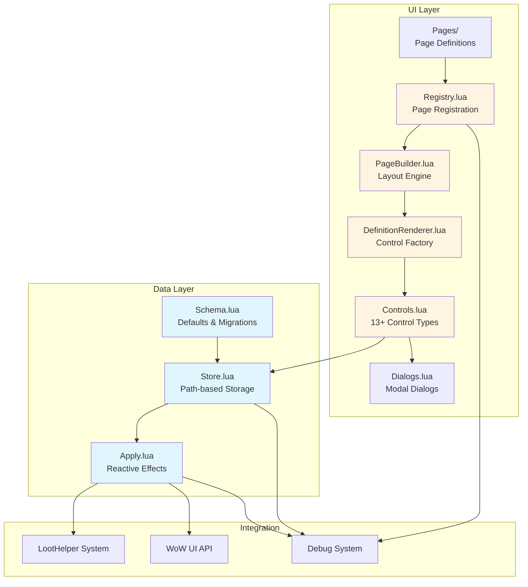

# Settings UI Architecture

The Settings UI system is a comprehensive, declarative framework for managing addon configuration. It provides a data-driven approach to building settings pages with automatic state management, validation, and reactive updates.

## Overview

The Settings UI system consists of two main layers:

**Data Layer**

- **Schema** - Defines default values, enums, and version migrations
- **Store** - Path-based storage with callbacks and profile management
- **Apply** - Reactive effects that respond to setting changes (debounced and combat-aware)

**UI Layer**

- **Registry** - Page registration and lifecycle management
- **PageBuilder** - Layout engine for scrollable pages with sections
- **DefinitionRenderer** - Converts declarative page definitions into UI controls
- **Controls** - 13+ control types with automatic state binding
- **Dialogs** - Modal confirmation and prompt dialogs
- **Pages** - Declarative page definitions (Main, LootHelper)

## Architecture Diagram



## Key Features

**Declarative UI**

- Pages defined as data structures, not imperative code
- Automatic control creation from specifications
- Conditional visibility and section management

**Path-based Storage**

- Dot notation access (e.g., `"global.fontSize"`)
- Flexible schema evolution
- Profile-specific settings support

**Combat-aware Operations**

- Queues apply operations during combat
- Automatic execution when combat ends
- Prevents UI errors during encounters

**Reactive Updates**

- Callbacks trigger on setting changes
- Debounced effects reduce redundant operations
- Automatic UI refresh on state changes

**Profile Management**

- ID-based profile storage
- Active profile tracking
- Profile-specific settings isolation

## Quick Start

### Adding a New Setting

1. **Define the setting in Schema**:

```lua
-- modules/Settings/Schema.lua
DEFAULTS = {
    global = {
        myNewSetting = true
    }
}
```

2. **Add to a page definition**:

```lua
-- modules/UI/Settings/Pages/Main.lua
{
    type = "checkbox",
    label = "My New Setting",
    path = "global.myNewSetting",
    tooltip = "Description of what this does"
}
```

3. **Access the setting**:

```lua
local value = SF.Settings.Store:Get("global.myNewSetting")
SF.Settings.Store:Set("global.myNewSetting", false)
```

### Reacting to Setting Changes

```lua
SF.Settings.Apply:RegisterCallback("myFeature", function(newValue, oldValue, path)
    if path == "global.myNewSetting" then
        -- React to the change
        UpdateMyFeature(newValue)
    end
end)
```

## Documentation Sections

For detailed information about each component:

- **[Data Layer](data-layer.md)** - Schema, Store, and Apply modules
- **[UI Layer](ui-layer.md)** - Registry, PageBuilder, and DefinitionRenderer
- **[Controls](controls.md)** - Available control types and usage
- **[Creating Pages](creating-pages.md)** - Guide to adding new settings pages
- **[Best Practices](best-practices.md)** - Design patterns and conventions

## Integration Points

The Settings UI integrates with:

- **LootHelper** - Profile management and safe mode settings
- **Debug System** - All operations logged with appropriate levels
- **WoW API** - Blizzard Settings API for native integration
- **WoW Classes** - Class color codes for admin lists

## File Structure

```
SpectrumFederation/modules/
├── Settings/
│   ├── Schema.lua          # Defaults, enums, migrations
│   ├── Store.lua           # Storage with callbacks
│   └── Apply.lua           # Reactive effects
└── UI/Settings/
    ├── Registry.lua        # Page registration
    ├── PageBuilder.lua     # Layout engine
    ├── DefinitionRenderer.lua  # Control factory
    ├── Dialogs.lua         # Modal dialogs
    ├── Style.lua           # UI constants
    ├── Control/
    │   └── Controls.lua    # Control implementations
    ├── Pages/
    │   ├── Main.lua        # Main settings page
    │   └── LootHelper.lua  # LootHelper page
    └── Widgets/
        └── Section.lua     # Section containers
```

## Next Steps

- Read the [Data Layer](data-layer.md) documentation to understand state management
- Learn about [Controls](controls.md) to see available UI components
- Follow the [Creating Pages](creating-pages.md) guide to add new settings pages
- Review [Best Practices](best-practices.md) for design patterns
