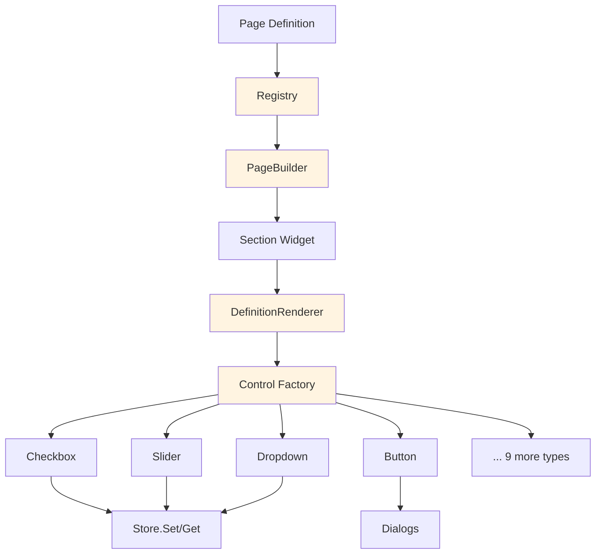

# Settings UI Layer

The UI layer renders settings pages from declarative definitions and handles user interaction. It consists of Registry, PageBuilder, DefinitionRenderer, Controls, and Dialogs.

## Architecture



## Registry Module

**Location**: `SpectrumFederation/modules/UI/Settings/Registry.lua`

The Registry manages page lifecycle and integrates with the Blizzard Settings API.

### Core Methods

#### RegisterPage

```lua
Registry:RegisterPage(pageId, title, definition, options)
```

**Parameters**:

- `pageId` (string) - Unique identifier for the page
- `title` (string) - Display title
- `definition` (table) - Page structure (sections and controls)
- `options` (table, optional) - Configuration options
  - `parent` (string) - Parent page ID for sub-pages
  - `order` (number) - Display order

**Example**:

```lua
SF.Settings.Registry:RegisterPage(
    "main",
    "Spectrum Federation",
    {
        { type = "section", title = "General", controls = { ... } }
    }
)
```

#### GetPage

```lua
Registry:GetPage(pageId)
```

**Parameters**:

- `pageId` (string) - The page identifier

**Returns**:

- `page` (table|nil) - Page metadata or nil if not found

### Page Lifecycle

1. **Registration** - `RegisterPage()` stores page definition
2. **First Open** - Panel created, `PageBuilder:Build()` called, `__sfBuilt` flag set
3. **Refresh** - Existing panel reuses controls, only updates values
4. **Re-layout** - Window resize triggers section reflow

### Integration with Blizzard Settings

```lua
-- Register with WoW Settings UI
local category = Settings.RegisterCanvasLayoutCategory(panel, title)
Settings.RegisterAddOnCategory(category)
```

Pages appear in the native Escape menu under "AddOns".

## PageBuilder Module

**Location**: `SpectrumFederation/modules/UI/Settings/PageBuilder.lua`

The PageBuilder creates scrollable layouts with sections.

### Building a Page

```lua
PageBuilder:Build(panel, definition)
```

**Parameters**:

- `panel` (Frame) - The container frame
- `definition` (table) - Array of section definitions

**Process**:

1. Creates scroll frame with child content frame
2. Iterates through sections
3. For each section:
   - Creates Section widget
   - Passes control definitions to DefinitionRenderer
   - Anchors section below previous
4. Sets up scroll bar and mouse wheel handler
5. Registers resize handler for reflow

**Example Definition**:

```lua
{
    {
        type = "section",
        title = "General Settings",
        intro = "Configure basic addon behavior",
        controls = {
            { type = "checkbox", label = "Enable", path = "global.enabled" },
            { type = "slider", label = "Scale", path = "global.scale", min = 0.5, max = 2.0 }
        }
    },
    {
        type = "section",
        title = "Advanced",
        condition = function() return IsAdvancedMode() end,
        controls = { ... }
    }
}
```

### Section Widget

**Location**: `SpectrumFederation/modules/UI/Settings/Widgets/Section.lua`

Sections group related controls with optional titles, intro text, and reset buttons.

**Features**:

- Optional title with horizontal line
- Intro text with word wrapping
- Reset button with confirmation dialog
- Error/warning/success message display
- Conditional visibility
- Collapsible (future feature)

**Creating a Section**:

```lua
local section = SF.Settings.Widgets.Section.Create(parent, {
    title = "Profile Settings",
    intro = "Manage your loot profiles",
    resetPath = "lootHelper.profiles",
    condition = function()
        return SF.Settings.Store:Get("lootHelper.enabled")
    end
})
```

### Layout and Reflow

The PageBuilder handles dynamic layout:

```lua
-- Initial layout
PageBuilder:Build(panel, definition)

-- Reflow on resize
panel:SetScript("OnSizeChanged", function(self)
    PageBuilder:Reflow(self)
end)
```

## DefinitionRenderer Module

**Location**: `SpectrumFederation/modules/UI/Settings/DefinitionRenderer.lua`

The DefinitionRenderer converts declarative control definitions into WoW UI controls.

### Rendering Controls

```lua
DefinitionRenderer:Render(parent, controlDefinitions)
```

**Parameters**:

- `parent` (Frame) - Container frame
- `controlDefinitions` (table) - Array of control specs

**Returns**:

- `controls` (table) - Array of created control frames

**Process**:

1. Iterates through control definitions
2. For each definition:
   - Validates type
   - Calls appropriate factory function from Controls module
   - Sets up state binding (get/set)
   - Applies conditional visibility
   - Anchors control below previous
3. Returns array of controls for section management

### Control Definition Format

```lua
{
    type = "checkbox",           -- Control type (required)
    label = "Enable Feature",    -- Display label
    path = "global.enabled",     -- Store path for auto-binding
    tooltip = "Enables the feature",
    adminOnly = true,             -- Optional UI-only admin gating
    help = "Additional help text",
    
    -- OR custom binding
    get = function() return GetValue() end,
    set = function(value) SetValue(value) end,
    
    -- Optional visibility
    visible = function() return IsEnabled() end,
    enabled = function() return CanChange() end
}
```

Section `condition` controls section visibility. Use item-level `adminOnly = true` when a setting should remain visible to all users but become greyed out and non-interactable for non-admins.

### State Binding

The renderer automatically binds controls to the Store:

**Path-based (automatic)**:

```lua
{
    type = "checkbox",
    path = "global.enabled",  -- Auto-binds to Store:Get/Set
    label = "Enable"
}
```

**Custom (manual)**:

```lua
{
    type = "dropdown",
    label = "Active Profile",
    get = function()
        return SF.Settings.Store:GetActiveLootHelperProfileData()
    end,
    set = function(profileId)
        SF.Settings.Store:SetActiveLootHelperProfileId(profileId)
    end,
    items = function()
        return GetProfileList()
    end
}
```

### Conditional Visibility

Controls can be shown/hidden dynamically:

```lua
{
    type = "slider",
    label = "Advanced Setting",
    path = "global.advancedValue",
    visible = function()
        -- Only show if advanced mode is enabled
        return SF.Settings.Store:Get("global.advancedMode") == true
    end
}
```

The visibility function is re-evaluated:

- On section refresh
- When dependent settings change
- When `RefreshPage()` is called

## Controls Module

**Location**: `SpectrumFederation/modules/UI/Settings/Control/Controls.lua`

The Controls module provides factory functions for 13+ control types.

### Available Control Types

| Type | Description | Key Options |
|------|-------------|-------------|
| `checkbox` | Boolean toggle | `label`, `tooltip` |
| `slider` | Numeric range | `min`, `max`, `step`, `format` |
| `dropdown` | Selection list | `items`, `width` |
| `editbox` | Text input | `placeholder`, `maxLetters` |
| `button` | Click action | `label`, `onClick` |
| `display` | Read-only value | `label`, `format` |
| `help` | Formatted help text | `text`, `color` |
| `text` | Simple label | `text`, `fontSize` |
| `spacer` | Vertical spacing | `height` |
| `dropdownIconButton` | Dropdown with icon button | `items`, `iconButton` |
| `editboxButton` | Editbox with button | `buttonLabel`, `onButtonClick` |
| `scrollList` | Scrollable item list | `items`, `height`, `itemTemplate` |

See the [Controls documentation](controls.md) for detailed information on each type.

### Factory Pattern

Each control type has a factory function:

```lua
Controls.CreateCheckbox(parent, opts)
Controls.CreateSlider(parent, opts)
Controls.CreateDropdown(parent, opts)
-- ... etc
```

**Common Options**:

- `get` (function) - Value getter
- `set` (function) - Value setter
- `path` (string) - Auto-bind to Store path
- `enabled` (function) - Enable state
- `visible` (function) - Visibility state
- `tooltip` (string) - Hover tooltip
- `help` (string) - Help text below control

**Example**:

```lua
local checkbox = SF.Settings.Controls.CreateCheckbox(parent, {
    label = "Enable Feature",
    path = "global.featureEnabled",
    tooltip = "Enables the cool new feature",
    help = "This feature requires restart"
})
```

### Auto-save Binding

Controls automatically save changes to the Store:

```lua
checkbox:SetScript("OnClick", function(self)
    local newValue = self:GetChecked()
    opts.set(newValue)  -- Calls Store:Set() or custom setter
end)
```

No manual "Save" button needed - changes are immediate.

## Dialogs Module

**Location**: `SpectrumFederation/modules/UI/Settings/Dialogs.lua`

The Dialogs module provides modal dialogs for user confirmation and input.

### Confirm Dialog

```lua
Dialogs.Confirm(message, acceptText, onAccept)
```

**Parameters**:

- `message` (string) - Confirmation message
- `acceptText` (string, optional) - Accept button label (default: "Confirm")
- `onAccept` (function) - Callback when confirmed

**Example**:

```lua
SF.Settings.Dialogs.Confirm(
    "Delete this profile? This action cannot be undone.",
    "Delete",
    function()
        DeleteProfile(profileId)
    end
)
```

### Prompt Dialog

```lua
Dialogs.Prompt(message, text, defaultText, onAccept)
```

**Parameters**:

- `message` (string) - Prompt message
- `text` (string) - Input label
- `defaultText` (string, optional) - Pre-filled text
- `onAccept` (function) - Callback with entered text: `function(enteredText)`

**Example**:

```lua
SF.Settings.Dialogs.Prompt(
    "Create New Profile",
    "Enter profile name:",
    "",
    function(name)
        CreateProfile(name)
    end
)
```

### Dialog Implementation

Dialogs use WoW's `StaticPopupDialogs` system:

```lua
StaticPopupDialogs["SF_SETTINGS_CONFIRM"] = {
    text = "%s",
    button1 = "Confirm",
    button2 = "Cancel",
    OnAccept = function(self, data)
        data.onAccept()
    end,
    timeout = 0,
    whileDead = true,
    hideOnEscape = true
}
```

## Page Refresh

Pages can be refreshed to update control values and visibility:

```lua
SF.Settings.Registry:RefreshPage(pageId)
```

**Triggers**:

- Profile switch
- Setting change that affects visibility
- Manual refresh request

**Process**:

1. Calls `visible()` for each control
2. Calls `get()` to update values
3. Re-evaluates section conditions
4. Triggers reflow if layout changed

## UI Style Constants

**Location**: `SpectrumFederation/modules/UI/Settings/Style.lua`

Defines consistent styling:

```lua
SF.Settings.Style = {
    COLORS = {
        TEXT = {1, 1, 1},
        SUBTEXT = {0.7, 0.7, 0.7},
        ACCENT = {0.3, 0.6, 1.0}
    },
    FONTS = {
        NORMAL = "Fonts\\FRIZQT__.TTF",
        BOLD = "Fonts\\ARIALN.TTF"
    },
    SPACING = {
        SECTION = 20,
        CONTROL = 8,
        INDENT = 20
    }
}
```

## Best Practices

### Page Organization

**DO**:

- Group related settings in sections
- Use clear, descriptive titles
- Provide intro text for complex sections
- Order settings logically (simple → advanced)

**DON'T**:

- Create flat lists of 50+ controls
- Mix unrelated settings in one section
- Use technical jargon in labels

### Control Selection

**DO**:

- Use checkboxes for boolean toggles
- Use sliders for numeric ranges
- Use dropdowns for 3+ options
- Use editboxes for free-form text

**DON'T**:

- Use editbox for boolean (use checkbox)
- Use dropdown for yes/no (use checkbox)
- Use slider for 2-3 discrete values (use dropdown)

### Help Text

**DO**:

- Explain what the setting does
- Mention if restart required
- Link to related documentation
- Use `help` type for formatted guidance

**DON'T**:

- Repeat the label in help text
- Use technical implementation details
- Write essay-length help text

### Performance

**DO**:

- Use `condition` functions for expensive checks
- Debounce rapidly-changing controls (sliders)
- Lazy-load complex dropdown items
- Cache visibility results where possible

**DON'T**:

- Call expensive functions in `get()` on every refresh
- Fetch data from server in control functions
- Create controls for hidden sections

## Debugging

Enable debug logging to trace UI operations:

```lua
/sfdebug on
```

**Log Categories**:

- `SETTINGS:REGISTRY` - Page registration and lifecycle
- `SETTINGS:PAGEBUILDER` - Page building and reflow
- `SETTINGS:RENDERER` - Control creation
- `SETTINGS:CONTROLS` - Control interactions

**Example Output**:

```
[SETTINGS:REGISTRY] Registering page 'main'
[SETTINGS:PAGEBUILDER] Building page with 3 sections
[SETTINGS:RENDERER] Rendering 12 controls
[SETTINGS:CONTROLS] Checkbox 'global.enabled' changed: true
```

## Next Steps

- Learn about [Controls](controls.md) in detail
- Follow the [Creating Pages](creating-pages.md) guide
- Review [Best Practices](best-practices.md)
