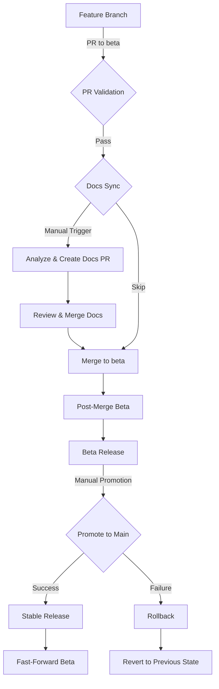
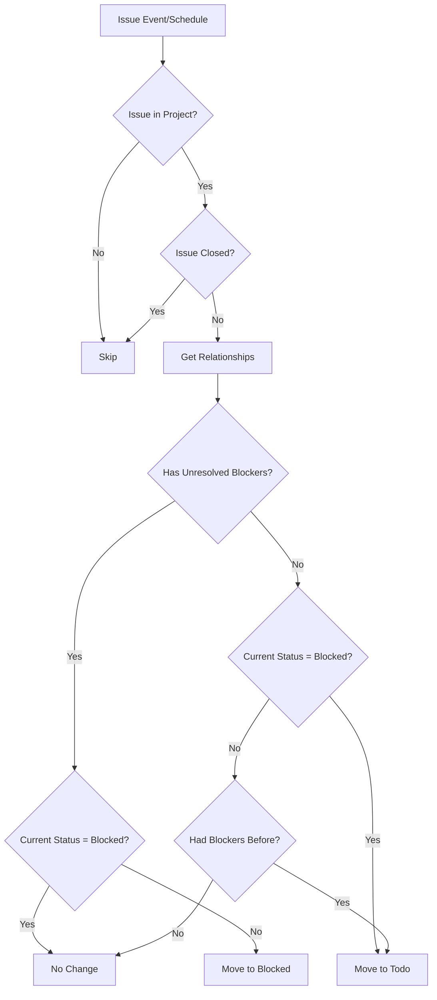
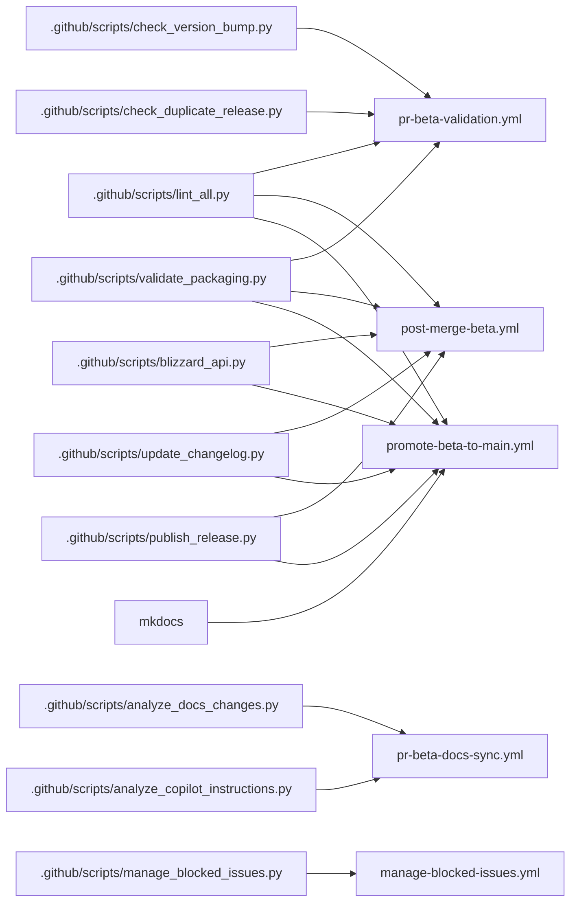

# CI/CD Workflow Guide

This guide explains the comprehensive CI/CD workflows for SpectrumFederation, implementing a beta-first development model with controlled promotions.

## Workflow Overview



## Workflow Files

### 1. PR Validation (`pr-beta-validation.yml`)

**Trigger**: Pull requests to `beta` branch  
**Purpose**: Validate code quality and versioning before merge

**Jobs**:
- **lint**: Run luacheck (Lua), yamllint (YAML), ruff (Python)
- **validate-packaging**: Verify WoW addon structure
- **check-version-bump**: Ensure version was bumped in TOC
- **check-duplicate-beta-release**: Prevent duplicate beta releases

**Required For Merge**: All jobs must pass

---

### 2. Documentation Sync (`pr-beta-docs-sync.yml`)

**Trigger**: Manual (`workflow_dispatch`)  
**Purpose**: Analyze code changes and suggest documentation/copilot instruction updates

**Inputs**:
- `pr_number`: PR number to analyze (required)

**Jobs**:
1. **analyze-and-update-docs**: Analyze PR changes and create documentation updates

---

### 3. Manage Blocked Issues (`manage-blocked-issues.yml`)

**Trigger**: 
- Issue events (opened, edited, closed, reopened, deleted)
- Schedule (every 30 minutes)
- Manual (`workflow_dispatch`)

**Purpose**: Automatically manage issue status in GitHub Projects v2 based on blocking relationships

**How It Works**:
1. Monitors issues for changes in relationships (blocking/blocked by)
2. Checks if an issue has unresolved "blocked by" relationships
3. Moves issues to "Blocked" column if they have open blocking issues
4. Moves issues to "Todo" column when all blockers are resolved

**Flow Diagram**:


**Jobs**:
- **manage-blocked-status**: Query relationships and update project status

**Inputs** (workflow_dispatch only):
- `issue_number`: Optional issue number to check (checks all if not provided)

**Example Scenarios**:

| Scenario | Current Status | Blocking Issues | Action |
|----------|---------------|-----------------|--------|
| Issue has open blockers | Any | 1+ open | Move to "Blocked" |
| Issue blockers resolved | Blocked | All closed | Move to "Todo" |
| Issue has no blockers | Blocked | None | Move to "Todo" |
| Issue has no blockers | Todo | None | No change |

**Manual Trigger**:
```bash
# Check a specific issue
Navigate to Actions → Manage Blocked Issues
Enter issue number (e.g., 42)
Run workflow

# Check all issues
Navigate to Actions → Manage Blocked Issues
Leave issue number empty
Run workflow
```

**Scheduled Execution**:
- Runs every 30 minutes automatically
- Catches relationship changes that may be missed by issue events
- Ensures project board stays in sync

**Requirements**:
- Issues must be in GitHub Project #1 ("Spectrum Federation Addon")
- Project must have "Status" field with "Blocked" and "Todo" options
- Workflow requires `issues: write` permission

---

### 4. Documentation Sync Details (`pr-beta-docs-sync.yml`)

**How It Works**:
   - Get PR details and verify it targets beta branch
   - Checkout PR branch and fetch beta for comparison
   - Analyze documentation changes using GitHub Copilot API
   - Analyze copilot instructions changes using GitHub Copilot API
   - Create commit with suggested changes
   - Create new PR targeting the original PR branch
   - Comment on original PR with link to documentation PR

**Key Features**:
- Manual trigger only (shows as required check but doesn't block until run)
- Uses GitHub Copilot API to intelligently suggest documentation updates
- Cross-references code changes with existing docs and copilot instructions
- Takes into account any docs updates user already made
- Creates separate PR for review before merging into original PR
- Automatically comments on original PR when complete

**How to Use**:
1. Open your PR to beta branch
2. Navigate to Actions → PR Beta Documentation Sync
3. Click "Run workflow"
4. Enter your PR number
5. Review the generated documentation PR
6. Merge the documentation PR into your feature branch
7. Your original PR will now have updated documentation

**Note**: This workflow is designed to be a **required workflow** for beta PRs but must be manually triggered when you're ready. It won't block your PR until you run it.

---

### 5. Post-Merge Beta (`post-merge-beta.yml`)

**Trigger**: Push to `beta` branch (after PR merge)  
**Purpose**: Automate beta release creation and documentation updates

**Jobs** (sequential):
1. **sanity-checks**: Re-run lint and packaging validation
2. **extract-version**: Query Blizzard API for Beta Interface version
3. **update-changelog**: Update CHANGELOG.md using GitHub Copilot
4. **update-readme-badges**: Update README.md badges
5. **publish-beta-release**: Create GitHub release with `-beta` suffix

**Concurrency**: Single beta release at a time (no cancellation)

---

### 6. Promotion Workflow (`promote-beta-to-main.yml`)

**Trigger**: Manual (`workflow_dispatch`) - Admin only  
**Purpose**: Promote stable beta version to main branch

**Inputs**:
- `dry_run`: Test promotion without making changes (default: `false`)

**Jobs** (sequential):
1. **pre-merge-validation**: Validate beta state before merge
2. **merge-beta-to-main**: Merge beta → main with special handling
   - Use `-X ours` strategy for CHANGELOG.md and README.md
   - Remove `-beta` suffix from version
   - Query Blizzard API for Live Interface version
3. **update-changelog-main**: Update CHANGELOG.md on main
4. **update-readme-main**: Update README.md badges for main
5. **deploy-docs**: Deploy documentation to GitHub Pages
6. **publish-stable-release**: Create stable GitHub release
7. **fast-forward-beta**: Sync beta to match main
8. **summary**: Display promotion summary

**Safety Features**:
- Dry-run mode for testing
- Validation before merge
- Automatic fast-forward of beta

---

### 7. Rollback Workflow (`rollback-release.yml`)

**Trigger**: Manual (`workflow_dispatch`) - Admin only  
**Purpose**: Revert a failed beta→main promotion

**Inputs**:
- `release_tag`: Tag to rollback (e.g., `v0.1.0`)
- `dry_run`: Test rollback without making changes (default: `false`)

**Jobs** (sequential):
1. **validate-rollback**: Find and validate the merge commit
2. **revert-merge**: Revert the promotion merge commit
3. **delete-release**: Delete GitHub release and tag
4. **restore-changelog**: Restore previous CHANGELOG.md
5. **summary**: Display rollback summary

**Safety Features**:
- Dry-run mode for testing
- Validates merge commit before revert
- Preserves git history (revert, not reset)

---

### 8. Linter (`linter.yml`)

**Trigger**: Push/PR to `main` or `beta`  
**Purpose**: Continuous code quality checks

**Jobs**:
- **lint**: Run unified linter (`.github/scripts/lint_all.py`)
  - Lua: luacheck
  - YAML: yamllint
  - Python: ruff

---

### 9. Deploy Docs (Integrated in `promote-beta-to-main.yml`)

**Trigger**: During stable release promotion  
**Purpose**: Deploy MkDocs documentation to GitHub Pages

**Jobs** (within promote-beta-to-main workflow):
- **build**: Build static site using `mkdocs build`
- **upload**: Upload site artifact using `actions/upload-pages-artifact@v3`
- **deploy**: Deploy to GitHub Pages using `actions/deploy-pages@v4`

**Method**: GitHub Actions native Pages deployment (OIDC-based authentication)

---

## Development Workflow

### Standard Feature Development

1. **Create Feature Branch**
   ```bash
   git checkout beta
   git pull
   git checkout -b feature/my-feature
   ```

2. **Implement Feature**
   - Make changes to addon code
   - Bump version in `SpectrumFederation.toc`
   - Test in-game with `/reload`
   - Run `luacheck SpectrumFederation --only 0`

3. **Create Pull Request**
   - PR to `beta` branch
   - Wait for PR validation to pass
   - Get code review approval

4. **Documentation Sync (Optional but Recommended)**
   - Navigate to Actions → PR Beta Documentation Sync
   - Click "Run workflow" and enter your PR number
   - Wait for analysis to complete
   - Review the generated documentation PR
   - Make any adjustments if needed
   - Merge the documentation PR into your feature branch
   - Your PR now includes updated documentation

5. **Merge to Beta**
   - PR is merged to `beta`
   - Post-merge workflow automatically:
     - Validates code quality
     - Updates changelog
     - Updates README badges
     - Creates beta release

6. **Promote to Main** (Admin Only)
   - Test beta release thoroughly
   - Navigate to Actions → Promote Beta to Main
   - Run workflow (optionally with dry-run)
   - Promotion workflow automatically:
     - Merges beta → main
     - Removes `-beta` suffix
     - Updates documentation
     - Creates stable release
     - Fast-forwards beta to main

### Emergency Rollback

If a promotion causes issues:

1. **Identify Release Tag**
   - Find the problematic release (e.g., `v0.1.0`)

2. **Run Rollback Workflow**
   - Navigate to Actions → Rollback Release
   - Enter release tag
   - Run workflow (optionally with dry-run)

3. **Verify Rollback**
   - Check main branch history
   - Verify release was deleted
   - Confirm CHANGELOG was restored

4. **Fix Issues**
   - Make fixes in beta branch
   - Test thoroughly
   - Re-run promotion when ready

---

## Version Management

### Version Format

- **Beta**: `X.Y.Z-beta.N` (e.g., `0.0.17-beta.1`)
- **Stable**: `X.Y.Z` (e.g., `0.0.17`)

### Version Bumping Rules

- **Every behavioral change requires a version bump**
- **Non-behavioral changes (docs, comments) do not require a version bump**
- **CI will fail if version is not bumped for behavioral changes**

### Automatic Version Updates

The promotion workflow automatically:
1. Removes `-beta` suffix from version
2. Updates `## Interface:` field using Blizzard API
3. Creates release tag with `v` prefix (e.g., `v0.0.17`)

---

## Blizzard API Integration

The workflows query Blizzard's patch server to determine the correct `## Interface:` version:

- **Beta Branch**: Queries `us.patch.battle.net:1119/wow_beta/versions`
- **Main Branch**: Queries `us.patch.battle.net:1119/wow/versions`

**Response Format** (pipe-delimited):
```
us|84c35b3be4dae06e2070c8f9adae2ecd|11.2.7.64978|1
```

**Interface Conversion**:
- Game version `11.2.7.64978` → Interface `110207`
- Format: `XXYYZZ` where `XX.YY.ZZ` is the version

**Authentication**: None required (public endpoints)

---

## Troubleshooting

### PR Validation Fails

**Lint Errors**:
```bash
# Run linter locally
python3 .github/scripts/lint_all.py
```

**Packaging Errors**:
```bash
# Validate addon structure
python3 .github/scripts/validate_packaging.py
```

**Version Not Bumped**:
- Update `## Version:` in `SpectrumFederation/SpectrumFederation.toc`
- Commit and push changes

**Duplicate Beta Release**:
- Version already released
- Bump version again to create new release

---

### Post-Merge Beta Fails

**Changelog Update Fails**:
- Check GITHUB_TOKEN permissions
- Verify GitHub Copilot API is available
- Review commit messages for clarity

**Release Creation Fails**:
- Check for existing release/tag
- Verify GITHUB_TOKEN has `contents: write` permission

---

### Promotion Fails

**Merge Conflicts**:
- Manually merge beta → main
- Resolve conflicts
- Re-run promotion workflow

**Interface Version Fetch Fails**:
- Blizzard API may be temporarily unavailable
- Check network connectivity
- Retry workflow

**Fast-Forward Fails**:
- Beta has diverged from main
- Manually sync beta branch:
  ```bash
  git checkout beta
  git merge main
  git push
  ```

---

### Rollback Fails

**Merge Commit Not Found**:
- Verify release tag is correct
- Check that promotion actually occurred
- Review git history for merge commit

**Revert Conflicts**:
- Manually revert the merge commit:
  ```bash
  git checkout main
  git revert -m 1 <merge-commit>
  git push
  ```

---

## Branch Protection

Both `main` and `beta` branches are protected with the following rules:

- Require pull request reviews
- Require status checks to pass
- No force pushes
- PAT_TOKEN bypasses protection for automated commits

---

## Secrets Configuration

Required secrets in repository settings:

- **PAT_TOKEN**: Personal Access Token with admin privileges
  - Used to bypass branch protection for automated commits
  - Required for: changelog updates, badge updates, fast-forward

Optional secrets (for future use):

- **BLIZZARD_API_ID**: OAuth2 Client ID (currently unused)
- **BLIZZARD_API_SECRET**: OAuth2 Client Secret (currently unused)

---

## Testing Workflows

### Dry-Run Mode

Both promotion and rollback workflows support dry-run mode:

```bash
# Test promotion without making changes
# Navigate to Actions → Promote Beta to Main
# Set dry_run: true

# Test rollback without making changes
# Navigate to Actions → Rollback Release
# Set dry_run: true
```

Dry-run mode:
- Simulates all steps
- Displays what would happen
- Makes no actual changes
- Useful for testing and verification

---

## Workflow Dependencies



All workflows depend on the Python helper scripts in `.github/scripts/`.

---

## Future Improvements

Potential enhancements for the workflow system:

1. **Automated Regression Testing**
   - Run addon tests in-game
   - Validate UI elements
   - Check for Lua errors

2. **Performance Monitoring**
   - Track workflow execution time
   - Monitor API request latency
   - Alert on slow builds

3. **Release Notes Automation**
   - Generate release notes from commits
   - Include screenshots for UI changes
   - Link to related issues/PRs

4. **Multi-Region Support**
   - Query multiple Blizzard regions
   - Support EU, APAC endpoints
   - Handle region-specific versions

5. **Notification Integration**
   - Discord webhooks for releases
   - Email notifications for failures
   - Slack integration for team updates

---

## Additional Resources

- [MkDocs Documentation](https://www.mkdocs.org/) - Documentation framework
- [GitHub Actions Documentation](https://docs.github.com/en/actions) - Workflow syntax and features

**Note**: For Python helper script documentation, see `.github/scripts/README.md` in the repository root.
