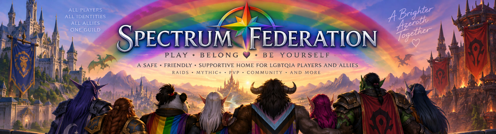
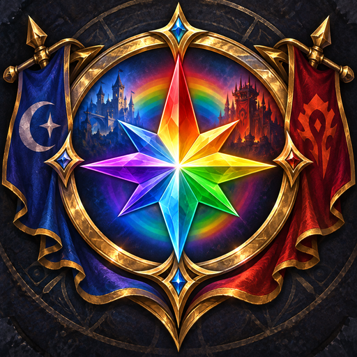
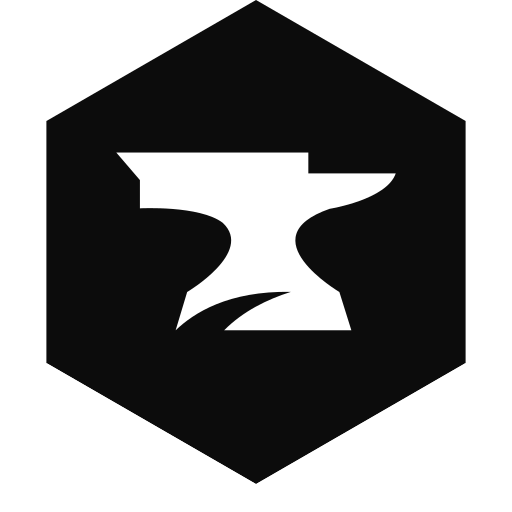

---
hide:
  - navigation
  - toc
---

  

{ .sf-landing__crest }

Garona-US · Addon docs

# Spectrum Federation

A World of Warcraft Retail addon for coordinating guild raid loot, and a home for LGBTQIA players and allies on Garona.

  <a class="sf-install-links__item" href="https://addons.wago.io/addons/spectrumfederation" title="Install with WowUp on Wago Addons" target="_blank" rel="noopener noreferrer">
    
    WowUp
  </a>
  <a class="sf-install-links__item" href="https://www.curseforge.com/wow/addons/spectrum-federation" title="Install with CurseForge" target="_blank" rel="noopener noreferrer">
    
    CurseForge
  </a>

[Install and get started](getting-started.md){ .md-button .md-button--primary }
[Open the feature guides](features/loot-helper.md){ .md-button }

## What the addon provides

- **Loot Helper** — a raid roster window where profile admins manage loot points or Attendance, add raid members, and record which equipment categories a member has used.
- **Loot profiles** — separate, named sets of members, admins, Point Based or Reward Pot rules, Raid Check options, and history.
- **Sync sessions** — group-wide profile and log synchronization, with automatic catch-up for late joiners and clients that missed updates.
- **Raid Check** — addon-owned current-Retail enchant and gem checks, optional whispers, and loot-point or Attendance awards for prepared profile members. The equipment audit lives under **Raid Equipment**.
- **Addon versions** — `/sf version` lists current raid or party members and the Spectrum Federation version each one is running.
- **Loot Logs** — a filterable history of point, Attendance, Reward Pot, equipment, profile, safe-mode, admin, and main-swap changes.
- **Cursed Surge Tracker** — a nested child addon that shows Curse Surge locations and countdowns on The Coiled Isle World Map. When installed it also appears as an Optional settings category; enable or disable it from WoW's AddOns list, not from `/sf`.
- **RC Loot Council Integration** — an optional nested child addon that records finalized RC Loot Council awards in Loot Logs while a Spectrum Loot Helper session is active. Open it from **Loot Helper → RC Loot Council**.
- **Mouse Tracer** — an optional, per-character rainbow cursor trail on **Gameplay → UI Enhancements**. It is off by default.

## Who can change shared data?

Everyone with the addon can view the active profile. Profile admins can change loot points, Attendance, the Reward Pot, and equipment history, manage profile settings and admins, run Raid Checks, and coordinate sync sessions. Only the profile owner can change loot mode. The profile creator is its initial owner and admin.

## About Spectrum Federation

Spectrum Federation is a cross-faction guild on Garona formed from Spectrum Phoenix and Spectrum Rage. The guild provides a friendly, supportive home for LGBTQIA players and allies across casual play, raiding, Mythic+, and PvP.

For guild membership information, visit the Spectrum Federation Discord.
