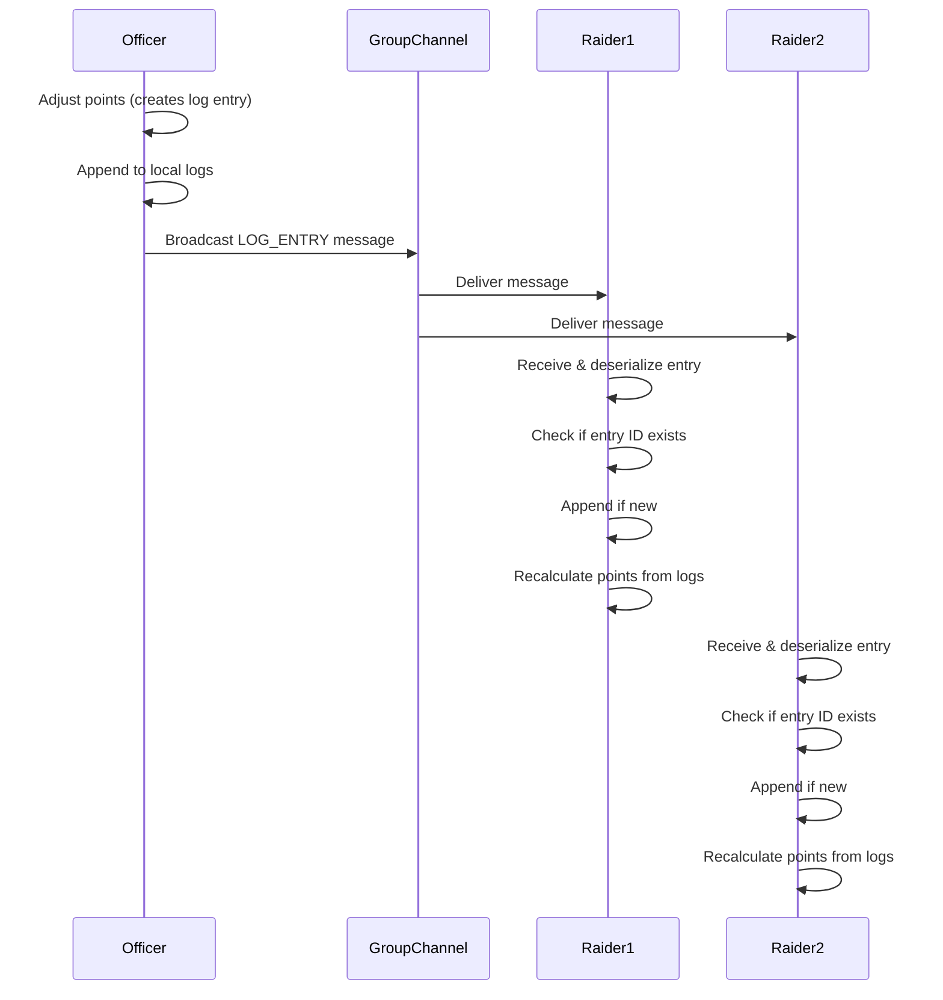
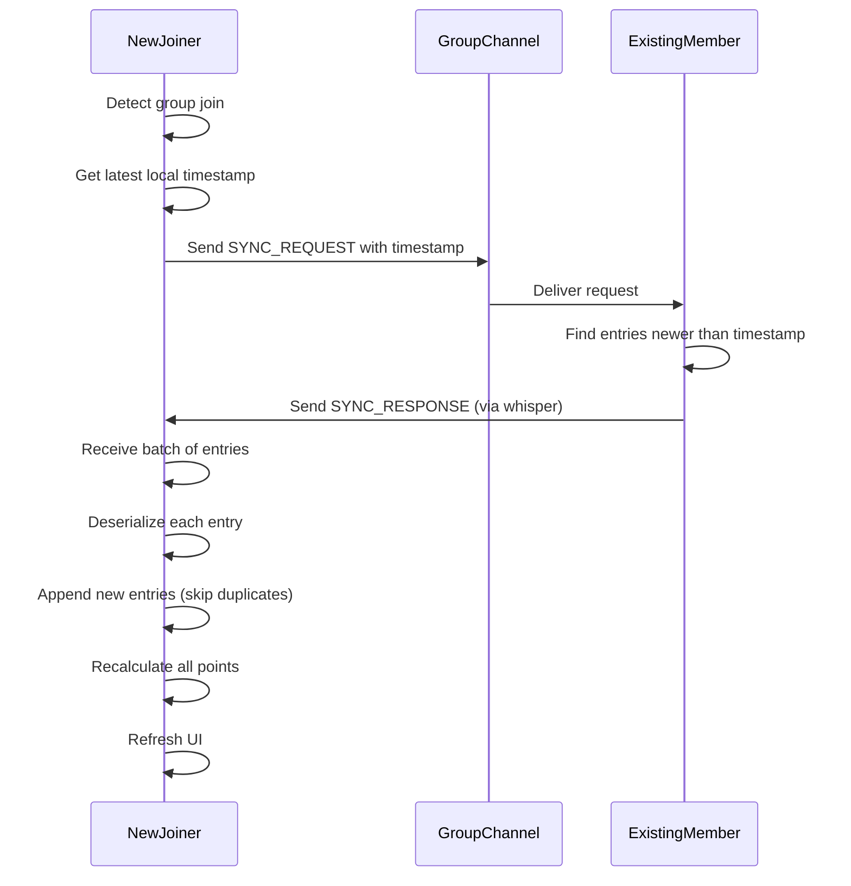

# Loot Sync

## What Loot Sync Does

Loot Sync automatically shares point adjustments between addon users in the same group or raid. This ensures:

- **Data stays consistent** between all addon users in your group
- **Offline changes sync** when you rejoin a group—officers can adjust points while solo, and those changes propagate when the raid reforms
- **Only log entries are synced**, not point totals directly. Points are always derived from the complete log history
- **No data loss** from conflicting edits—all changes are preserved as separate log entries

## How Syncing Works (High-Level)

The addon uses a **log-entry based model** where every point adjustment is an immutable event that gets shared between clients. Each log entry contains:

- Who made the change
- Who was affected
- The point delta and new total
- When it happened
- Why (reason)

When addon users are in a group:

- **New changes** are immediately broadcast to everyone
- **On group join**, each client requests any log entries they're missing
- **After receiving new entries**, points are automatically recalculated from the complete log history
- **Duplicate entries** are detected and skipped based on unique IDs

This append-only model means no log entries are ever modified or deleted—all changes are preserved in chronological order.

## When Syncing Happens

Syncing occurs automatically in these situations:

- **When you join a party or raid** with other addon users
- **When an officer adjusts points** while grouped
- **When you receive a sync request** from another player (they just joined)
- **After merging new log entries** from others

## Common Scenarios

### Late Joiner

**Scenario**: A raid member joins after you've made several point adjustments.

**What happens**: When they join the group, they automatically request sync. You send them all log entries they're missing. Their addon merges these entries and recalculates points, bringing them up to date within seconds.

### Offline Changes by an Officer

**Scenario**: An officer adjusts points while solo (perhaps correcting an error from last raid). Other players still have the old values.

**What happens**: When the officer joins the next raid, they broadcast a sync request. Their newer log entries are sent to everyone else. All clients merge the new entries and recalculate, so everyone sees the corrected values. This is the primary use case for sync.

### Multiple Officers Updating the Same Player

**Scenario**: Two officers independently adjust the same player's points (perhaps one adds points for attendance, another for loot).

**What happens**: Both changes create separate log entries with unique IDs and timestamps. When the officers group up, both entries sync to all clients. Points are recalculated by replaying all entries in chronological order, so both adjustments are applied correctly.

## Troubleshooting

**I don't see updated points after grouping up**

- Verify sync is working by checking debug logs: `/sfdebug on` then watch for "SYNC" messages
- Make sure both you and the other person have the addon loaded
- Check that you're actually in a group (not just nearby)

**My data looks wrong or inconsistent**

- Debug logging will show if sync messages are being sent/received
- Leave and rejoin the group to trigger a fresh sync
- In rare cases, the officer with the most recent changes may need to share them manually by forming a group

**I want to temporarily disable sync**

- Currently sync is always active when grouped
- Future versions may add a `/sf sync off` command
- For now, being solo prevents any sync from happening

## Technical Diagram

This diagram shows the sync flow when an officer adjusts points:

**Sync Request Flow** (when joining a group):

## Advanced Details

### Message Types

The addon uses three message types for communication:

- **SYNC_REQUEST**: "Tell me what I'm missing" (includes your latest timestamp)
- **SYNC_RESPONSE**: "Here are the entries you need" (batch of log entries)
- **LOG_ENTRY**: "Here's a new change" (single real-time update)

### Why Log-Based Instead of Point-Based?

Syncing point totals directly would be simpler, but leads to problems:

- **Conflict resolution**: If two officers change the same player's points while solo, whose value wins?
- **Lost changes**: Point-based sync must choose one value and discard the other
- **No audit trail**: You can't see the history of what changed and why

With log-based sync:

- **All changes are preserved**—every adjustment is a separate log entry
- **Deterministic results**—replaying logs in timestamp order always gives the same points
- **Full audit trail**—you can see exactly who changed what and when
- **Conflict-free merging**—multiple changes just mean multiple log entries

The trade-off is slightly more complexity in the sync logic, but much better data integrity.

