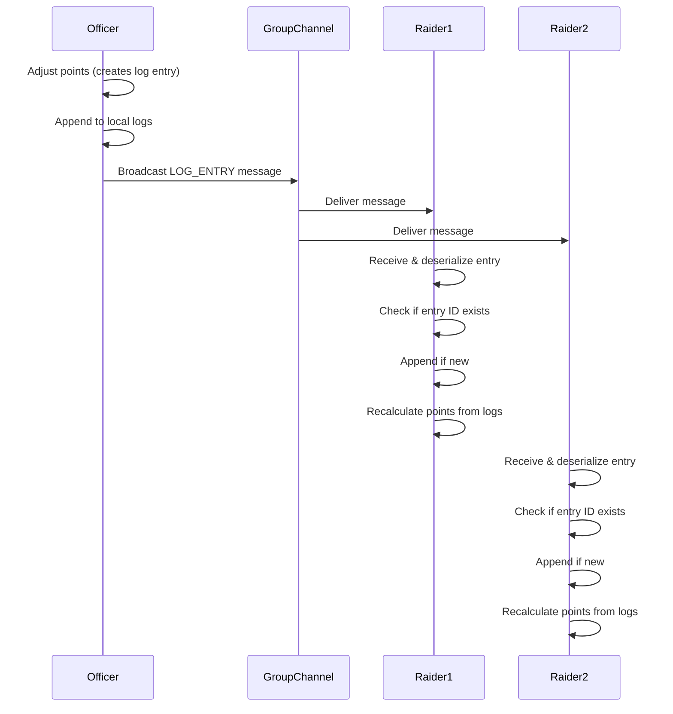
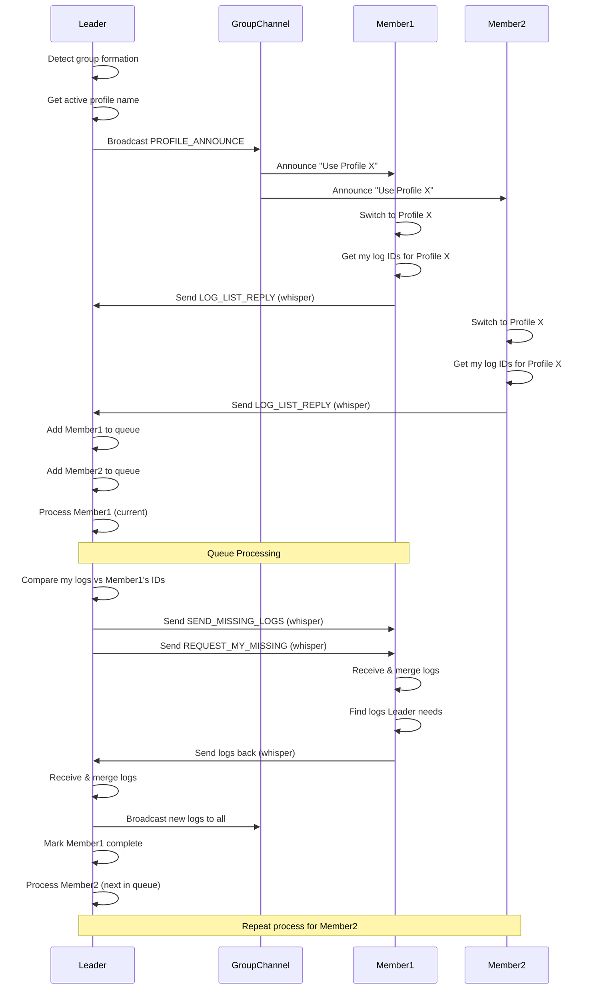
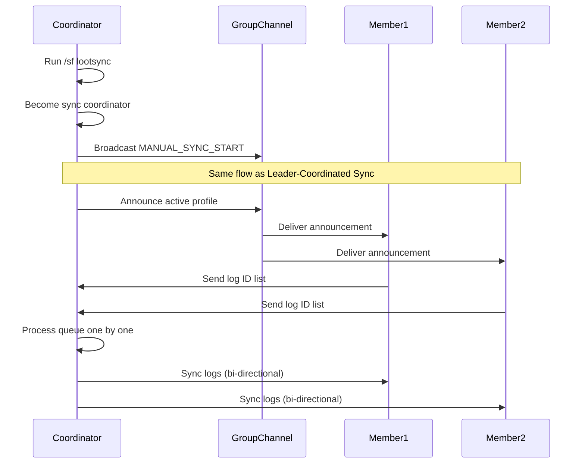

# Loot Sync

## What Loot Sync Does

Loot Sync automatically shares point adjustments between addon users in the same group or raid using a **profile-based, leader-coordinated system**. This ensures:

- **Data stays consistent** across all addon users in your group for a specific profile
- **Profile isolation**—different raid teams or groups can use separate profiles without interference
- **Offline changes sync** when you rejoin a group—officers can adjust points while solo, and those changes propagate when the raid reforms
- **Leader-coordinated**—the group leader acts as sync coordinator, preventing broadcast storms
- **Only log entries are synced**, not point totals directly. Points are always derived from the complete log history
- **No data loss** from conflicting edits—all changes are preserved as separate log entries

## Profiles

Profiles are independent sets of point data. Common use cases:

- **"Default"** - The default profile created for everyone
- **"Raid-Team-A"** - Main progression team
- **"Mythic-Plus"** - Separate tracking for M+ groups
- **"Alt-Runs"** - Casual content with different rules

Each profile has its own:
- Point totals per character
- Complete log history
- Independent sync state

## How Syncing Works (High-Level)

The addon uses a **log-entry based model** where every point adjustment is an immutable event that gets shared between clients. Each log entry contains:

- Who made the change
- Who was affected
- The point delta and new total
- When it happened
- Why (reason)
- Which profile it belongs to

### Leader-Coordinated Sync

When a group forms or someone runs `/sf lootsync`:

1. **Leader announces active profile** to the group
2. **Members switch to that profile** (or create it if missing)
3. **Members send their log ID lists** to the leader via whisper
4. **Leader processes members one-by-one** using a queue:
   - Compares log lists to find missing entries
   - Sends missing logs to the member
   - Receives missing logs from the member
   - Broadcasts newly received logs to the entire group
5. **Next member in queue** is processed once the current one is complete

This queue-based approach prevents chaos when many members join at once.

### Live Broadcasts

While grouped, any new point adjustments are **immediately broadcast** to all group members in real-time. This works alongside the leader-coordinated sync.

## When Syncing Happens

Syncing occurs automatically in these situations:

- **When a group forms** and you are the leader—your active profile becomes the group profile
- **When you join an existing group**—the leader tells you which profile to use, then syncs your data
- **When leadership changes**—the new leader can coordinate sync with any remaining queue
- **When an officer adjusts points while grouped**—broadcast to everyone immediately
- **Manual sync** via `/sf lootsync`—anyone can become sync coordinator on demand

## Common Scenarios

### Late Joiner to Existing Raid

**Scenario**: A raid member joins after the group has formed and you've made several point adjustments.

**What happens**: If you're the leader, they get added to your sync queue. When it's their turn, you compare log lists, send them missing entries, and receive any they have that you don't. They're synced within seconds and see the correct point values. All live broadcasts they missed are backfilled.

### Offline Changes by an Officer

**Scenario**: An officer adjusts points while solo (perhaps correcting an error from last raid). Other players still have the old values in the same profile.

**What happens**: When the officer forms a new raid or becomes leader, their active profile is announced. The leader-coordinated sync processes all members, sending the newer log entries to everyone. All clients merge the new entries and recalculate, so everyone sees the corrected values. This is the primary use case for sync.

### Multiple Officers Updating the Same Player

**Scenario**: Two officers independently adjust the same player's points in the same profile while solo (perhaps one adds points for attendance, another for loot).

**What happens**: Both changes create separate log entries with unique IDs and timestamps. When the officers group up, the leader-coordinated sync merges both sets of logs. Points are recalculated by replaying all entries in chronological order, so both adjustments are applied correctly. No data is lost.

### Different Profiles for Different Content

**Scenario**: You run a main raid with "Raid-Team-A" profile and also do casual M+ with "Mythic-Plus" profile. You want to keep them separate.

**What happens**: When forming the main raid, set your active profile to "Raid-Team-A" before inviting others. When you form the group, all members switch to that profile and sync its data. Later, for M+ content, switch to "Mythic-Plus" profile before forming the group. Each profile maintains independent data.

### Manual Sync When Leader Isn't Available

**Scenario**: The raid leader is AFK but you need to distribute some new logs you created offline.

**What happens**: Run `/sf lootsync` to become the sync coordinator. Your active profile is announced to the group, and you process the sync queue just like a leader would. This is useful for officers who need to push updates without waiting for leadership.

## Troubleshooting

**I don't see updated points after grouping up**

- Verify you're using the same profile as the leader: check `/sf` options → Active Profile
- Check debug logs: `/sfdebug on` then watch for "SYNC" and "PROFILE" messages
- Make sure both you and the leader have the addon loaded
- If you joined late, wait for your turn in the sync queue (leader processes one member at a time)
- Try manual sync: run `/sf lootsync` if you're an officer

**Wrong profile is being used**

- The leader's active profile determines the group profile
- If you want a different profile, switch your active profile via `/sf` before forming the group
- Members automatically switch to the announced profile when they join

**My data looks wrong or inconsistent**

- Verify you're looking at the correct profile in `/sf` options
- Debug logging will show profile switches and sync messages: `/sfdebug on`
- Leave and rejoin the group to trigger a fresh sync
- Run `/sf lootsync` manually to force a sync cycle

**Sync seems slow or stuck**

- Leader processes members one at a time using a queue—this is intentional
- If you're the leader and sync freezes, there may be a network issue with the current member
- Large log sets (>100 entries) may take 10-20 seconds to sync due to WoW's message throttling
- Check debug logs for errors: `/sfdebug show`

**I want to temporarily disable sync**

- Currently sync is always active when grouped
- Being solo prevents any sync from happening
- Future versions may add a `/sf sync off` command

**Profile management issues**

- Cannot delete the active profile—switch to another profile first
- Cannot delete the only remaining profile—at least one must exist
- Profile names have a 64-character limit

## Technical Diagrams

### Live Broadcast (Real-Time Point Adjustment)

This diagram shows the sync flow when an officer adjusts points while grouped:

### Leader-Coordinated Sync (Group Formation)

This diagram shows what happens when a group forms with a leader who has the addon:

### Manual Sync Flow

This diagram shows what happens when someone runs `/sf lootsync`:

## Advanced Details

### Message Types

The addon uses seven message types for communication:

**Leader/Coordinator Messages:**
- **PROFILE_ANNOUNCE**: "Everyone use this profile" (broadcast to group)
- **REQUEST_LOG_LIST**: "Send me your log IDs" (optional, members send automatically)
- **SEND_MISSING_LOGS**: "Here are logs you're missing" (whisper to specific member)
- **REQUEST_MY_MISSING**: "I need these log IDs from you" (whisper to specific member)

**Member Messages:**
- **LOG_LIST_REPLY**: "Here are my log IDs for this profile" (whisper to leader)

**Broadcast Messages:**
- **LOG_ENTRY**: "Here's a new change" (single real-time update to group)

**Manual Sync:**
- **MANUAL_SYNC_START**: "I'm initiating a manual sync" (becomes coordinator)

### Why Leader-Coordinated Instead of Peer-to-Peer?

A peer-to-peer sync where everyone talks to everyone would be simpler but causes problems:

- **Broadcast storms**: 40 people joining a raid all requesting sync simultaneously overwhelms the addon message system
- **Duplicate work**: Members send the same data to multiple people
- **Race conditions**: Competing sync operations interfere with each other
- **Throttling issues**: WoW throttles addon messages—too many at once get queued or dropped

With leader-coordinated sync:

- **One sync at a time**—the leader processes members sequentially using a queue
- **Efficient distribution**—leader broadcasts newly received logs once to everyone
- **No storms**—members only communicate with the leader, not each other
- **Graceful scaling**—works the same whether 5 or 40 people join

The trade-off is slightly longer sync time for large groups (1-2 seconds per member), but much better reliability.

### Why Profiles Instead of Tiers?

The old tier-based system was designed around WoW content tiers (e.g., "11.0.0" for Dragonflight Season 1). Profiles are more flexible:

- **Not tied to game versions**—you can name profiles however you want
- **Multiple groups simultaneously**—different raid teams can have separate data
- **Content-specific tracking**—separate profiles for raids, M+, PvP, etc.
- **Easier to understand**—"Raid-Team-A" is clearer than "0.0.14"

### Why Log-Based Instead of Point-Based?

Syncing point totals directly would be simpler, but leads to problems:

- **Conflict resolution**: If two officers change the same player's points while solo, whose value wins?
- **Lost changes**: Point-based sync must choose one value and discard the other
- **No audit trail**: You can't see the history of what changed and why

With log-based sync:

- **All changes are preserved**—every adjustment is a separate log entry
- **Deterministic results**—replaying logs in timestamp order always gives the same points
- **Full audit trail**—you can see exactly who changed what and when
- **Conflict-free merging**—multiple changes just mean multiple log entries

The trade-off is slightly more complexity in the sync logic, but much better data integrity.

### Queue System Details

When the leader receives log lists from multiple members:

1. Each member is added to a **processing queue** (FIFO)
2. The leader processes **one member at a time**:
   - Compare log lists
   - Send missing logs (up to 3 at a time due to message size limits)
   - Request logs the leader needs
   - Wait for member to send their logs back
   - Broadcast any newly received logs to the entire group
3. Once the current member is complete, the **next member is processed**
4. If new members join during sync, they're **added to the end of the queue**

This prevents overwhelming the addon message system and ensures reliable delivery.

### Throttling and Batching

WoW limits addon messages to 255 characters each. To work around this:

- Log entries are serialized into compact pipe-delimited format: `id|timestamp|actor|target|delta|newTotal|reason|profile`
- Log batches send 3-5 entries per message (depends on entry size)
- Large log sets are split into multiple whisper messages
- A 1-2 second delay is added between processing queue members to avoid throttling
- Log ID lists are compressed into comma-separated format: `1,5,7,12,45`

### Profile Auto-Creation

If the leader announces a profile that doesn't exist locally for a member:

- The member **automatically creates that profile** with empty logs/points
- The sync process then populates it with data from the leader
- This allows new members to join without manual profile setup

### Leadership Changes

If leadership changes during an active sync:

- The old leader **finishes their current member** in the queue
- New joiners after the leadership change sync with the **new leader**
- The old leader's remaining queue is **abandoned**
- The new leader can start a fresh sync cycle if needed

This prevents interruption mid-sync while allowing the new leader to take over.